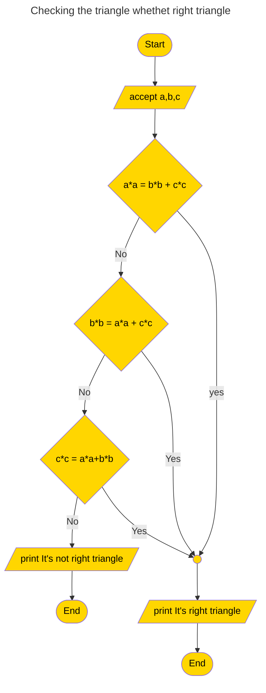

### Question:
Draw a flowchart that accepts three sides of triangle and tests whether right triangle or not.

### Answer:

```mermaid
---
title: Checking the triangle whethet right triangle
---
flowchart TD
    n1(["Start"]) --> n2["accept a,b,c"]
    n2 --> n3["a*a = b*b + c*c"]
    n3 -- No --> n4["b*b = a*a + c*c"]
    n4 -- No --> n5["c*c = a*a+b*b"]
    n4 -- Yes --> n8["Untitled Node"]
    n5 -- No --> n6@{ label: "print It's not right triangle" }
    n5 -- Yes --> n8
    n6 --> n7(["End"])
    n3 -- yes --> n8
    n8 --> n9@{ label: "print It's right triangle" }
    n9 --> n10(["End"])
    n2@{ shape: lean-r}
    n3@{ shape: diam}
    n4@{ shape: diam}
    n5@{ shape: diam}
    n8@{ shape: f-circ}
    n6@{ shape: lean-r}
    n9@{ shape: lean-r}
	n1:::Class_02
	n2:::Class_02
	n3:::Class_02
	n4:::Class_02
	n5:::Class_02
	n8:::Class_02
	n6:::Class_02
	n7:::Class_02
	n9:::Class_02
	n10:::Class_02
    classDef Class_02 fill:#FFD600, color:#000000
```
