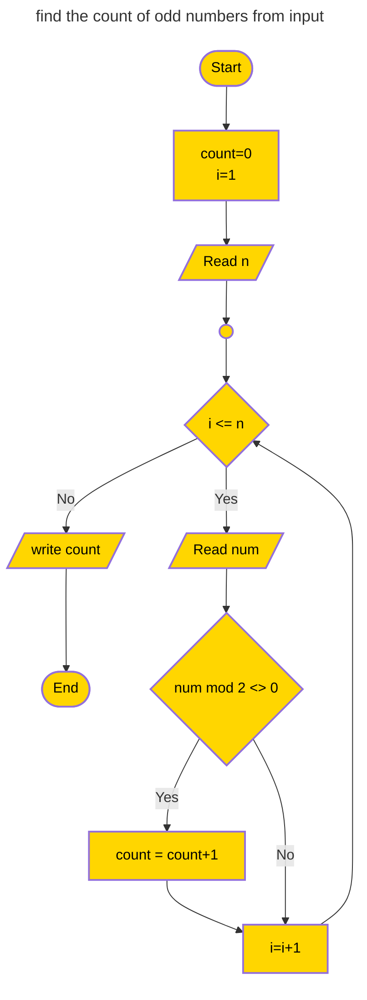

### Question:
Draw a flowchart that will input n integers and find the count of odd numbers.

### Answer:

```mermaid
---
title: find the count of odd numbers from input
---
flowchart TB
    A(["Start"]) --> B["count=0
i=1"]
    B --> C[/"Read n"/]
    C --> D((" "))
    D --> E{"i &lt;= n"}
    E -- No --> F[/"write count"/]
    F --> G(["End"])
    E -- Yes --> H[/"Read num"/]
    H --> I{"num mod 2 &lt;&gt; 0"}
    I -- Yes --> J["count = count+1"]
    J --> K["i=i+1"]
    I -- No --> K
    K --> E
     A:::Class_01
     B:::Class_01
     C:::Class_01
     D:::Class_01
     E:::Class_01
     F:::Class_01
     G:::Class_01
     H:::Class_01
     I:::Class_01
     J:::Class_01
     K:::Class_01
    classDef Class_01 fill:#FFD600, stroke-width:2px, stroke-dasharray: 0, color:#000000
```