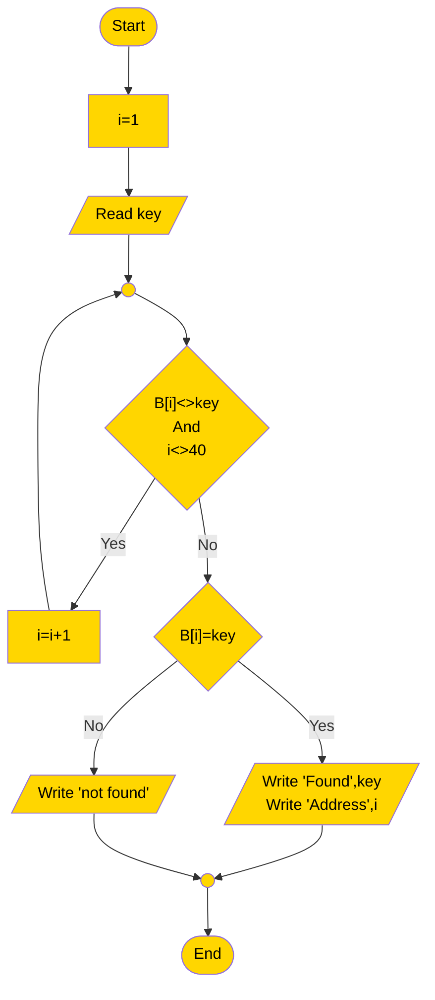

### Question:
Draw a flowchart for searching an item in a given array of length 40

### Answer:

```mermaid
flowchart TD
    n1(["Start"]) --> n2["i=1"]
    n2 --> n3["Read key"]
    n3 --> n4["Filled Circle"]
    n4 --> n5["B[i]&lt;&gt;key
     And
     i&lt;&gt;40"]
    n5 -- Yes --> n6["i=i+1"]
    n5 -- No --> n7["B[i]=key"]
    n6 --> n4
    n7 -- No --> n8@{ label: "Write 'not found'" }
    n7 -- Yes --> n9@{ label: "Write 'Found',key\n    Write 'Address',i" }
    n9 --> n10
    n8 --> n10
    n10 --> n11(["End"])

    n2@{ shape: rect}
    n3@{ shape: lean-r}
    n4@{ shape: f-circ}
    n5@{ shape: decision}
    n6@{ shape: rect}
    n7@{ shape: diam}
    n8@{ shape: lean-r}
    n9@{ shape: lean-r}
    n10@{ shape: f-circ}
     n1:::Class_01
     n2:::Class_01
     n3:::Class_01
     n4:::Class_01
     n5:::Class_01
     n6:::Class_01
     n7:::Class_01
     n8:::Class_01
     n9:::Class_01
     n10:::Class_01
     n11:::Class_01
    classDef Class_01 fill:#FFD600, color:#000000
```