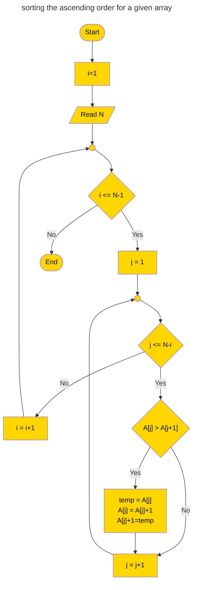

### Question:
Draw a flowchart to sort the ascending order for a given array.

### Answer:

```mermaid
---
title: sorting the ascending order for a given array
---
flowchart TD
    A(["Start"]) --> C["i=1"]
    C --> n1["Read N"]
    n1 --> n2["Untitled Node"]
    n2 --> n3["i &lt;= N-1"]
    n3 -- Yes --> n4["j = 1"]
    n3 -- No --> n5(["End"])
    n4 --> n6["Untitled Node"]
    n6 --> n7["j &lt;= N-i"]
    n7 -- No --> n8["i = i+1"]
    n7 -- Yes --> n9["A[j] &gt; A[j+1]"]
    n9 -- Yes --> n10["temp = A[j]
    A[j] = A[j]+1
    A[j]+1=temp"]
    n9 -- No --> n11["j = j+1"]
    n8 --> n2
    n11 --> n6
    n10 --> n11
    n1@{ shape: lean-r}
    n2@{ shape: f-circ}
    n3@{ shape: diam}
    n6@{ shape: f-circ}
    n7@{ shape: diam}
    n9@{ shape: diam}
     A:::Class_02
     C:::Class_02
     n1:::Class_02
     n2:::Class_02
     n3:::Class_02
     n4:::Class_02
     n5:::Class_02
     n6:::Class_02
     n7:::Class_02
     n8:::Class_02
     n9:::Class_02
     n10:::Class_02
     n11:::Class_02
    classDef Class_02 fill:#FFD600, color:#000000

```