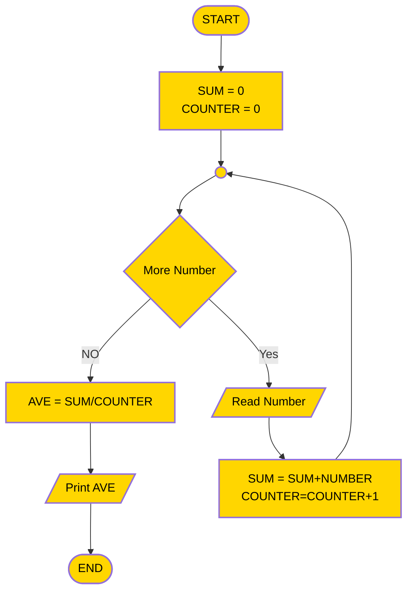

### Problem Example
#### Find the average of a given set of numbers.
##### Solution Steps
- Proceed as follows:
	1. Understanding the problem:
	2. Devising a plan:
	3. Identifying patterns, repetitions and familiar tasks:

1. Understanding the problem:

- Write down some numbers on paper and find the average manually, noting each step carefully.
    - e.g. Given a list say: 5, 3, 25, 0, 9
        - Count numbers	| i.e. How many? 5
        - Add them up | i.e. 5 + 3 + 25 + 0 + 9 = 42
        - Divide result by numbers counted | i.e. 42 / 5 = 8.4

2. Devising a plan:
- Make note of not what you did in steps (i) through (iv), but how you did it. In doing so, you will begin to develop the algorithm.
	- e.g. How do we count the numbers?
        * Starting at 0 i.e. set COUNTER to 0
        * Look at 1st number, add 1 to COUNTER
        * Look at 2nd number, add 1 to COUNTER and so   on,
        * until you reach the end of the list
	- How do we add numbers?
        * Let SUM be the sum of numbers in list. Set SUM to 0
        * Look at 1st number, add number to SUM
        * Look at 2nd number, add number to SUM and so on,
        * until we reach end of list
    - How do we compute the average?
	    * Let AVE be the average
        * then AVE = SUM/COUNTER

3. Identifying patterns, repetitions and familiar tasks.
    * Familiarity: Unknown number of items? i.e. n item
    * Patterns : look at each number in the list
    * Repetitions: Look at a number
		- Add number to sum
		- Add 1 to counter

### A flowchart representation of the algorithm for the above problem can be as follows:

