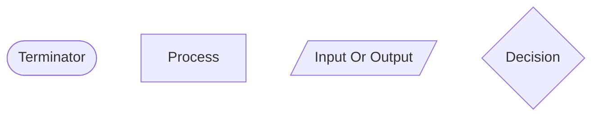
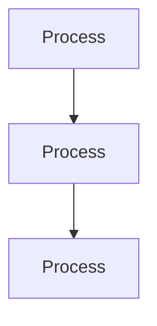
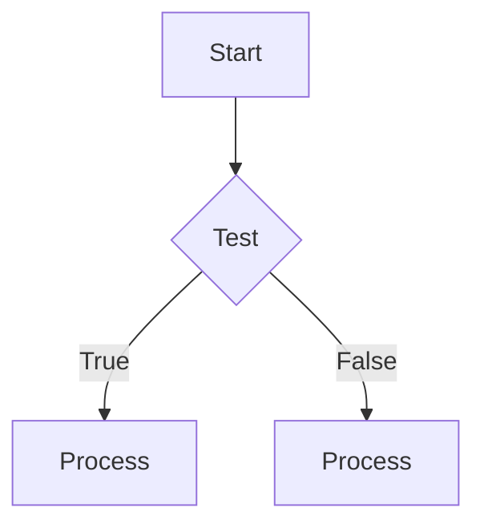
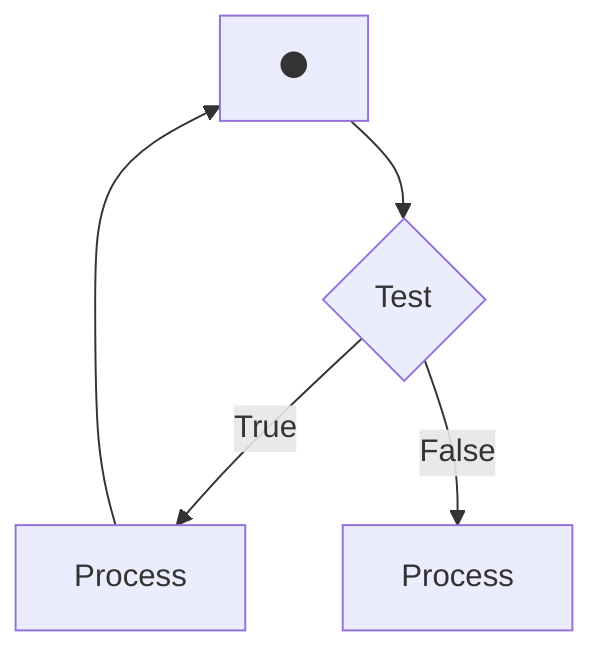

## Introduction
Possibly the simplest and easiest method to understand the steps in an algorithm, is by using flowchart method. This algorithm is composed of block symbols to represent each step in the solution process as well as the directed paths of each step.

### Advantages
*	Effective to express operation procedures clearly
*	Expressed graphically and easily understandable
*	With too much freedom allowed, it is rather difficult to keep structuring logic

---

### Basic Flowchart symbols

⚫ Connector  
&rarr; Data Flow  

1. The Terminator shows where a specific piece of an algorithm begins and end
2. A process is a basic action or actions on data
3. A decision is a logical test with two possible data paths resulting from one
4. Input/Output gets data or displays information to the user of the algorithm
5. A connector connects two or more data flows into one
6. A data flow shows the direction of data’s movement through the algorithm 

---

### Example for Sequence

---

### Example for Selection

---

### Example for iteration

